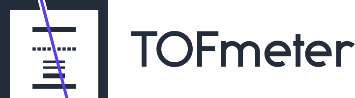

<h1 align="center">
  
</h1>

Code for the cosmic-muon TOF-meter project at SJTU: a plastic-scintillator time-of-flight
tracker with a lead layer on top and a Compton detector, built to identify materials from the
muonic X-rays of stopped muons. The repository holds the data-acquisition setup and the Geant4
simulation.

## Folders

| Folder | What it is for |
|---|---|
| [`DAQ_CAEN/`](DAQ_CAEN/) | Data acquisition with CAEN V1725B digitizers on the V1718 VME-USB bridge. `README.md` is a tested runbook for bringing up a new board (clock switch, VME address, waveform-recording firmware, PLL, first WaveDump run, board log); `analyze_pedestal.py` histograms the pedestal of every channel from WaveDump output and fits it with a Gaussian. |
| [`simulation/`](simulation/) | Geant4 simulation of the detector (program `TOFmeter`). How to build and run it: [`simulation/README.md`](simulation/README.md). |
| [`data/`](data/) | Project logos: `tofmeter-logo-text.svg` (the header of this README); `tofmeter-logo-mark.svg` and `tofmeter-logo-mark-reversed.svg` (icon of the simulation's Qt GUI on light and dark desktops). |

Build directories and simulation output are not tracked (see `.gitignore`).

## License

MIT, see [`LICENSE`](LICENSE).
